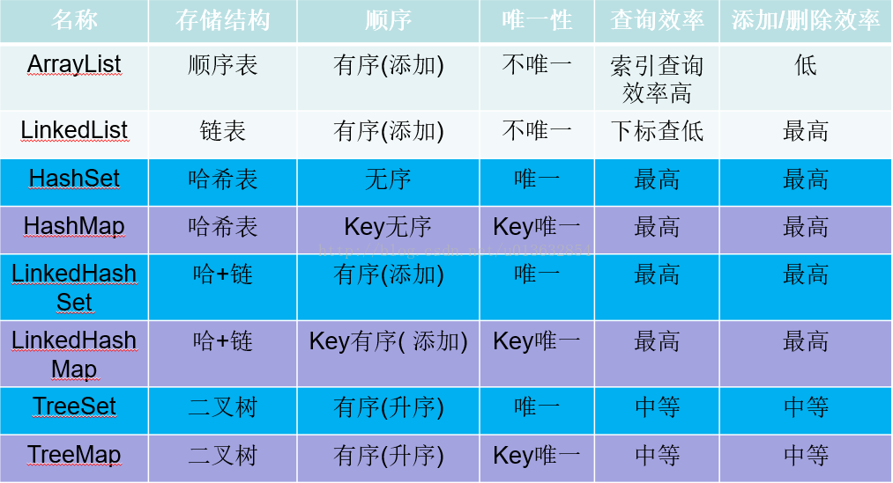
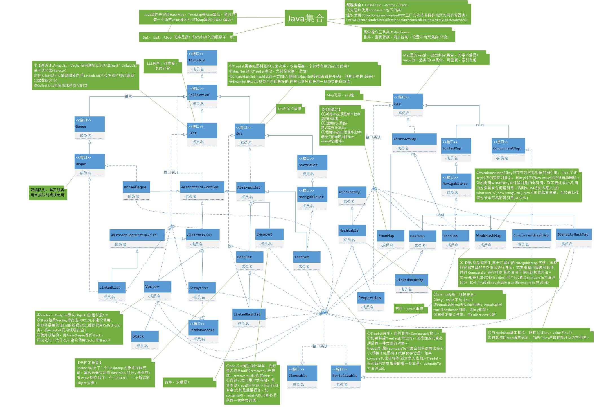

# Java编程思想(第5版)读书笔记

## 集合





Java集合类的思想是: 持有对象(Holding Objects), 可分为两种概念:

1. **集合(Collection)**: 一个独立元素的序列，这些元素都服从一条或多条规则。**List** 必须以插入的顺序保存元素， **Set** 不能包含重复元素， **Queue** 按照*排队规则*来确定对象产生的顺序（通常与它们被插入的顺序相同）。
2. **映射(Map)**:   一组成对的“键值对”对象，允许使用键来查找值。 **ArrayList** 使用数字来查找对象，因此在某种意义上讲，它是将数字和对象关联在一起。 **map** 允许我们使用一个对象来查找另一个对象，它也被称作*关联数组*（associative array），因为它将对象和其它对象关联在一起；或者称作*字典*（dictionary），因为可以使用一个键对象来查找值对象，就像在字典中使用单词查找定义一样.


### 添加元素组

`Arrays.asList()` 方法接受一个数组或是逗号分隔的元素列表（使用可变参数），并将其转换为 **List** 对象。 `Collections.addAll()` 方法接受一个 **Collection** 对象，以及一个数组或是一个逗号分隔的列表，将其中元素添加到 **Collection** 中。下边的示例展示了这两个方法，以及更通用的 、所有 **Collection** 类型都包含的`addAll()` 方法. 也可以直接使用 `Arrays.asList()` 的输出作为一个 **List** ，但是这里的底层实现是数组，没法调整大小。如果尝试在这个 **List** 上调用 `add()` 或 `remove()`，由于这两个方法会尝试修改数组大小，所以会在运行时得到“Unsupported Operation（不支持的操作）”错误:

```java
import java.util.*;

public class AddingGroups {
    public static void main(String[] args) {
        Collection<Integer> collection = new ArrayList<>(Arrays.asList(1, 2, 3, 4, 5));
        Integer[] moreInts = new Integer[]{6, 7, 8, 9, 10};
        collection.addAll(Arrays.asList(moreInts));
        Collections.addAll(collection, 11, 12, 13, 14, 15);
        Collections.addAll(collection, moreInts);
        System.out.println(collection.toString());
        List<Integer> integerList = Arrays.asList(moreInts);
        // 修改第一个元素的值为100
        integerList.set(0, 100);
        System.out.println(integerList.toString());
        
        /* java.lang.UnsupportedOperationException */
        // integerList.add(21);  // Runtime error; the underly array cannot be resized.
    }
}
```

上面的代码能看到, 如果要向上转型List元素, 则元素必须是同一层级的子类. 否则会`add/remove`不成功.

### 打印集合

```java
package com.killshadow.thinkingjava.collections;

import java.util.*;

public class PrintingCollections {
    static Collection
    fill(Collection<String> collection) {
        collection.add("rat");
        collection.add("cat");
        collection.add("dog");
        collection.add("dog");
        return collection;
    }
    static Map fill(Map<String, String> map) {
        map.put("rat", "Fuzzy");
        map.put("cat", "Rags");
        map.put("dog", "Bosco");
        map.put("dog", "Spot");
        return map;
    }
    public static void main(String[] args) {
        System.out.println(fill(new ArrayList<>())); // 线性表
        System.out.println(fill(new LinkedList<>())); // 双向链表
        System.out.println(fill(new HashSet<>())); // 哈希集合, 不能含有重复的元素, 无序, 线程不安全
        System.out.println(fill(new TreeSet<>())); // 可以排序, 线程不安全
        System.out.println(fill(new LinkedHashSet<>())); // LinkedHashSet是一种有序的Set集合，即其元素的存入和输出的顺序是相同的
        System.out.println(fill(new HashMap<>())); // 类比于HashSet
        System.out.println(fill(new TreeMap<>())); // 类比于TreeSet
        System.out.println(fill(new LinkedHashMap<>())); // 类比于LinkedHashSet
    }
}
/** Output:
 * [rat, cat, dog, dog]
 * [rat, cat, dog, dog]
 * [rat, cat, dog]
 * [cat, dog, rat]
 * [rat, cat, dog]
 * {rat=Fuzzy, cat=Rags, dog=Spot}
 * {cat=Rags, dog=Spot, rat=Fuzzy}
 * {rat=Fuzzy, cat=Rags, dog=Spot}
 * */
```

这显示了Java集合库中的两个主要类型。它们的区别在于集合中的每个“槽”（slot）保存的元素个数。 **Collection** 类型在每个槽中只能保存一个元素。此类集合包括： **List** ，它以特定的顺序保存一组元素； **Set** ，其中元素不允许重复； **Queue** ，只能在集合一端插入对象，并从另一端移除对象（就本例而言，这只是查看序列的另一种方式，因此并没有显示它）。 **Map** 在每个槽中存放了两个元素，即*键*和与之关联的*值*。

默认的打印行为，使用集合提供的 `toString()` 方法即可生成可读性很好的结果。 **Collection** 打印出的内容用方括号括住，每个元素由逗号分隔。 **Map** 则由大括号括住，每个键和值用等号连接（键在左侧，值在右侧）。

**HashSet** ， **TreeSet** 和 **LinkedHashSet** 是 **Set** 的类型。从输出中可以看到， **Set** 仅保存每个相同项中的一个，并且不同的 **Set** 实现存储元素的方式也不同。 **HashSet** 使用相当复杂的方法存储元素，这在[附录：集合主题]()中进行了探讨。现在只需要知道，这种技术是检索元素的最快方法，因此，存储顺序看上去没有什么意义（通常只关心某事物是否是 **Set** 的成员，而存储顺序并不重要）。如果存储顺序很重要，则可以使用 **TreeSet** ，它将按比较结果的升序保存对象）或 **LinkedHashSet** ，它按照被添加的先后顺序保存对象。

### 列表List

```java
package com.killshadow.thinkingjava.collections;

// collections/ListFeatures.java

import com.killshadow.thinkingjava.typeinfo.pets.*;

import java.util.*;

public class ListFeatures {
    public static void main(String[] args) {
        Random rand = new Random(47);
        List<Pet> pets = Pets.list(7);
        System.out.println("1: " + pets);
        Hamster h = new Hamster();
        // 1. add方法
        pets.add(h); // Automatically resizes
        System.out.println("2: " + pets);
        // 2. contain方法
        System.out.println("3: " + pets.contains(h));
        // 3. remove方法
        pets.remove(h); // Remove by object
        // 4. get方法
        Pet p = pets.get(2);
        // 5. indexOf方法
        System.out.println(
                "4: " +  p + " " + pets.indexOf(p));
        Pet cymric = new Cymric();
        System.out.println("5: " + pets.indexOf(cymric));
        System.out.println("6: " + pets.remove(cymric));
        // Must be the exact object:
        System.out.println("7: " + pets.remove(p));
        System.out.println("8: " + pets);
        pets.add(3, new Mouse()); // Insert at an index
        System.out.println("9: " + pets);
        // 6. subList方法: 切割list
        List<Pet> sub = pets.subList(1, 4);
        System.out.println("subList: " + sub);
        System.out.println("10: " + pets.containsAll(sub));
        // 7. sort方法: 对list排序
        Collections.sort(sub); // In-place sort
        System.out.println("sorted subList: " + sub);
        // Order is not important in containsAll():
        // 8. containAll: 检查是否包含入参list的所有元素(无序)
        List<Pet> copyPets = new LinkedList<>();
        copyPets.addAll(sub);
        copyPets.add(pets.get(5));
        System.out.println(pets + ":" + copyPets);
        System.out.println("11: " + pets.containsAll(copyPets));
        // 9. shuffle: 使用指定随机源对sub的元素置换
        Collections.shuffle(sub, rand); // Mix it up
        System.out.println("shuffled subList: " + sub);
        System.out.println("12: " + pets.containsAll(sub));
        List<Pet> copy = new ArrayList<>(pets);
        sub = Arrays.asList(pets.get(1), pets.get(4), new Cymric());
        System.out.println("sub: " + sub);
        // 10. 保留copy中与sub重复的元素
        copy.retainAll(sub);
        System.out.println("13: " + copy);
        copy = new ArrayList<>(pets); // Get a fresh copy
        copy.remove(pets.get(2)); // Remove by index
        System.out.println("14: " + copy);
        copy.removeAll(sub); // Only removes exact objects
        System.out.println("15: " + copy);
        copy.set(1, new Mouse()); // Replace an element
        System.out.println("16: " + copy);
        copy.addAll(2, sub); // Insert a list in the middle
        System.out.println("17: " + copy);
        System.out.println("18: " + pets.isEmpty());
        pets.clear(); // Remove all elements
        System.out.println("19: " + pets);
        System.out.println("20: " + pets.isEmpty());
        pets.addAll(Pets.list(4));
        System.out.println("21: " + pets);
        Object[] o = pets.toArray();
        System.out.println("22: " + o[3]);
        Pet[] pa = pets.toArray(new Pet[0]);
        System.out.println("23: " + pa[3].id());
    }
}
/* Output:
1: [Rat, Manx, Cymric, Mutt, Pug, Cymric, Pug]
2: [Rat, Manx, Cymric, Mutt, Pug, Cymric, Pug, Hamster]
3: true
4: Cymric 2
5: -1
6: false
7: true
8: [Rat, Manx, Mutt, Pug, Cymric, Pug]
9: [Rat, Manx, Mutt, Mouse, Pug, Cymric, Pug]
subList: [Manx, Mutt, Mouse]
10: true
sorted subList: [Manx, Mouse, Mutt]
[Rat, Manx, Mouse, Mutt, Pug, Cymric, Pug]:[Manx, Mouse, Mutt, Cymric]
11: true
shuffled subList: [Mouse, Manx, Mutt]
12: true
sub: [Mouse, Pug, Cymric]
13: [Mouse, Pug]
14: [Rat, Mouse, Mutt, Pug, Cymric, Pug]
15: [Rat, Mutt, Cymric, Pug]
16: [Rat, Mouse, Cymric, Pug]
17: [Rat, Mouse, Mouse, Pug, Cymric, Cymric, Pug]
18: false
19: []
20: true
21: [Manx, Cymric, Rat, EgyptianMau]
22: EgyptianMau
23: 15
*/
```

### 迭代器

*迭代器*（也是一种设计模式）的概念实现了这种抽象。迭代器是一个对象，它在一个序列中移动并选择该序列中的每个对象，而客户端程序员不知道或不关心该序列的底层结构。另外，迭代器通常被称为*轻量级对象*（lightweight object）：创建它的代价小。因此，经常可以看到一些对迭代器有些奇怪的约束。例如，Java 的 **Iterator** 只能单向移动。这个 **Iterator** 只能用来：

1. 使用 `iterator()` 方法要求集合返回一个 **Iterator**。 **Iterator** 将准备好返回序列中的第一个元素。
2. 使用 `next()` 方法获得序列中的下一个元素。
3. 使用 `hasNext()` 方法检查序列中是否还有元素。
4. 使用 `remove()` 方法将迭代器最近返回的那个元素删除。

```java
package com.killshadow.thinkingjava.collections;

// collections/SimpleIteration.java
import com.killshadow.thinkingjava.typeinfo.pets.*;

import java.util.*;

public class SimpleIteration {
    public static void main(String[] args) {
        List<Pet> pets = Pets.list(12);
        // 1. 集合都有iterator方法转为迭代器
        Iterator<Pet> it = pets.iterator();
        // 2. while循环的条件是迭代器还有下一个元素
        while(it.hasNext()) {
            // 3. 返回下一个元素
            Pet p = it.next();
            System.out.print(p.id() + ":" + p + " ");
        }
        System.out.println();
        // A simpler approach, when possible:
        for(Pet p : pets)
            System.out.print(p.id() + ":" + p + " ");
        System.out.println();
        // An Iterator can also remove elements:
        it = pets.iterator();
        for(int i = 0; i < 6; i++) {
            it.next();
            it.remove();
        }
        System.out.println(pets);
    }
}
/* Output:
0:Rat 1:Manx 2:Cymric 3:Mutt 4:Pug 5:Cymric 6:Pug
7:Manx 8:Cymric 9:Rat 10:EgyptianMau 11:Hamster
0:Rat 1:Manx 2:Cymric 3:Mutt 4:Pug 5:Cymric 6:Pug
7:Manx 8:Cymric 9:Rat 10:EgyptianMau 11:Hamster
[Pug, Manx, Cymric, Rat, EgyptianMau, Hamster]
*/
```

#### ListIterator

**ListIterator** 可以双向移动。它还可以生成相对于迭代器在列表中指向的当前位置的后一个和前一个元素的索引，并且可以使用 `set()` 方法替换它访问过的最近一个元素。

```java
package com.killshadow.thinkingjava.collections;

// collections/ListIteration.java
import com.killshadow.thinkingjava.typeinfo.pets.*;
import java.util.*;

public class ListIteration {
    public static void main(String[] args) {
        List<Pet> pets = Pets.list(8);
        ListIterator<Pet> it = pets.listIterator();
        System.out.println(pets);
        // 1. while循环条件, 还有下一元素
        while(it.hasNext())
            // 2. 分别输出下一元素的idx和当前的index.
            System.out.print(it.next() +
                    ", " + it.nextIndex() +
                    ", " + it.previousIndex() + "; ");
        System.out.println();
        // Backwards:
        while(it.hasPrevious())
            System.out.print(it.previous().id() + " ");
        System.out.println();
        System.out.println(pets);
        it = pets.listIterator(3);
        while(it.hasNext()) {
            it.next();
            // 3. Pets.get() 方法用来从位置 3 开始替换 List 中的所有 Pet 对象。
            it.set(Pets.get());
        }
        // 4. 回到上一步
        it.previous();
        it.previous();
        System.out.println(it.next());
        System.out.println(pets);
    }
}
/* Output:
[Rat, Manx, Cymric, Mutt, Pug, Cymric, Pug, Manx]
Rat, 1, 0; Manx, 2, 1; Cymric, 3, 2; Mutt, 4, 3; Pug, 5, 4; Cymric, 6, 5; Pug, 7, 6; Manx, 8, 7;
7 6 5 4 3 2 1 0
[Rat, Manx, Cymric, Mutt, Pug, Cymric, Pug, Manx]
Hamster
[Rat, Manx, Cymric, Cymric, Rat, EgyptianMau, Hamster, EgyptianMau]
*/
```

### 链表LinkedList

**LinkedList** 也像 **ArrayList** 一样实现了基本的 **List** 接口，但它在 **List** 中间执行插入和删除操作时比 **ArrayList** 更高效。然而,它在随机访问操作效率方面却要逊色一些。**LinkedList 还添加了一些方法，使其可以被用作栈、队列或双端队列（deque）** 。

- `getFirst()` 和 `element()` 是相同的，它们都返回列表的头部（第一个元素）而并不删除它，如果 **List** 为空，则抛出 **NoSuchElementException** 异常。 `peek()` 方法与这两个方法只是稍有差异，它在列表为空时返回 **null** 。

- `removeFirst()` 和 `remove()` 也是相同的，它们删除并返回列表的头部元素，并在列表为空时抛出 **NoSuchElementException** 异常。 `poll()` 稍有差异，它在列表为空时返回 **null** 。

- `addFirst()` 在列表的开头插入一个元素。

- `offer()` 与 `add()` 和 `addLast()` 相同。 它们都在列表的尾部（末尾）添加一个元素。

- `removeLast()` 删除并返回列表的最后一个元素。

```java
import com.killshadow.thinkingjava.typeinfo.pets.*;

import java.util.LinkedList;

public class LinkedListFeatures {
    public static void main(String[] args) {
        LinkedList<Pet> pets =
                new LinkedList<>(Pets.list(5));
        System.out.println(pets);
        // Identical:
        // 1. 获取第1个元素
        System.out.println(
                "pets.getFirst(): " + pets.getFirst());
        System.out.println(
                "pets.element(): " + pets.element());
        // Only differs in empty-list b	ehavior:(pets为空时, 返回null)
        System.out.println("pets.peek(): " + pets.peek());
        // Identical; remove and return the first element:
        System.out.println(
                "pets.remove(): " + pets.remove());
        System.out.println(
                "pets.removeFirst(): " + pets.removeFirst());
        // Only differs in empty-list behavior:(为空时, 反汇null)
        System.out.println("pets.poll(): " + pets.poll());
        System.out.println(pets);
        pets.addFirst(new Rat());
        System.out.println("After addFirst(): " + pets);
        pets.offer(Pets.get());
        System.out.println("After offer(): " + pets);
        pets.add(Pets.get());
        System.out.println("After add(): " + pets);
        pets.addLast(new Hamster());
        System.out.println("After addLast(): " + pets);
        System.out.println(
                "pets.removeLast(): " + pets.removeLast());
    }
}
/**Output:
 * [Rat, Manx, Cymric, Mutt, Pug]
 * pets.getFirst(): Rat
 * pets.element(): Rat
 * pets.peek(): Rat
 * pets.remove(): Rat
 * pets.removeFirst(): Manx
 * pets.poll(): Cymric
 * [Mutt, Pug]
 * After addFirst(): [Rat, Mutt, Pug]
 * After offer(): [Rat, Mutt, Pug, Cymric]
 * After add(): [Rat, Mutt, Pug, Cymric, Pug]
 * After addLast(): [Rat, Mutt, Pug, Cymric, Pug, Hamster]
 * pets.removeLast(): Hamster
 * */
```

### 堆栈stack

堆栈是“后进先出”（LIFO）集合. 可以想象成是自助餐厅的托盘, 最先放下的, 最后才能拿出来. 

```java
package com.killshadow.thinkingjava.collections;

import com.killshadow.thinkingjava.typeinfo.pets.*;

import java.util.Stack;

public class StackTest {
    public static void main(String[] args) {
        Stack<Pet> stack = new Stack<>();
        stack.addAll(Pets.list(4));
        System.out.println("Generate pets: "+stack);
        System.out.println("stack.pop: " + stack.pop());
        System.out.println("stack.peek: " + stack.peek());
        System.out.println("stack.peek after: " + stack);
        System.out.println("stack.firstElement: " + stack.firstElement());
        System.out.println("stack.lastElement: " + stack.lastElement());
        stack.push(new EgyptianMau());
        System.out.println("stack.push after: " + stack);
        stack.add(new Pug());
        System.out.println("stack.push after: " + stack);
        Pet manx = stack.get(1);
        System.out.println("stack.get(1): " + manx);
        System.out.println("stack.elementAt(1): " + stack.elementAt(1));
        System.out.println("stack.search: " + stack.search(manx));
        stack.set(1, new Dog());
        System.out.println("stack.set(1, new Dog()): " + stack);

    }
}
```

```java
package com.killshadow.thinkingjava.collections;

import java.util.ArrayDeque;
import java.util.Deque;

public class MyStack<T> {
    private Deque<T> storage = new ArrayDeque<>();
    public void push(T v) { storage.push(v); }
    public T peek() { return storage.peek(); }
    public T pop() { return storage.pop(); }
    public boolean isEmpty() { return storage.isEmpty(); }
    @Override
    public String toString() {
        return storage.toString();
    }
}
```

### 集合Set

**Set** 不保存重复的元素。 

```java
package com.killshadow.thinkingjava.collections;

import java.util.*;

public class SetTest {
    public static void main(String[] args) {
        Set<String> colors = new TreeSet<>();
        for(int i = 0; i < 100; i++) {
            colors.add("Yellow");
            colors.add("Blue");
            colors.add("Red");
            colors.add("Green");
            colors.add("Orange");
            colors.add("Yellow");
            colors.add("Black");
            colors.add("Purple");
        }
        System.out.println(colors);

        Set<String> set1 = new HashSet<>();
        Collections.addAll(set1,
                "A B C D E F G H I J K L".split(" "));
        set1.add("M");
        System.out.println("H: " + set1.contains("H"));
        System.out.println("N: " + set1.contains("N"));
        Set<String> set2 = new HashSet<>();
        Collections.addAll(set2, "H I J K L".split(" "));
        System.out.println(
                "set2 in set1: " + set1.containsAll(set2));
        set1.remove("H");
        System.out.println("set1: " + set1);
        System.out.println("set1: " + set1);
        System.out.println(
                "set2 in set1: " + set1.containsAll(set2));
        set1.removeAll(set2);
        System.out.println(
                "set2 removed from set1: " + set1);
        Collections.addAll(set1, "X Y Z".split(" "));
        System.out.println(
                "'X Y Z' added to set1: " + set1);
    }
}
/**Output:
 * [Black, Blue, Green, Orange, Purple, Red, Yellow]
 * H: true
 * N: false
 * set2 in set1: true
 * set1: [A, B, C, D, E, F, G, I, J, K, L, M]
 * set1: [A, B, C, D, E, F, G, I, J, K, L, M]
 * set2 in set1: false
 * set2 removed from set1: [A, B, C, D, E, F, G, M]
 * 'X Y Z' added to set1: [A, B, C, D, E, F, G, M, X, Y, Z]
 * */
```

### 映射Map

```java
package com.killshadow.thinkingjava.collections;

import com.killshadow.thinkingjava.typeinfo.pets.*;

import java.util.Arrays;
import java.util.HashMap;
import java.util.List;
import java.util.Map;

public class MapTest {
    public static final Map<Person, List< ? extends Pet>>
            petPeople = new HashMap<>();
    static {
        petPeople.put(new Person("Dawn"),
                Arrays.asList(
                        new Cymric("Molly"),
                        new Mutt("Spot")));
        petPeople.put(new Person("Kate"),
                Arrays.asList(new Cat("Shackleton"),
                        new Cat("Elsie May"), new Dog("Margrett")));
        petPeople.put(new Person("Marilyn"),
                Arrays.asList(
                        new Pug("Louie aka Louis Snorkelstein Dupree"),
                        new Cat("Stanford"),
                        new Cat("Pinkola")));
        petPeople.put(new Person("Luke"),
                Arrays.asList(
                        new Rat("Fuzzy"), new Rat("Fizzy")));
        petPeople.put(new Person("Isaac"),
                Arrays.asList(new Rat("Freckly")));
    }

    public static void main(String[] args) {
        Map<String, Pet> petMap = new HashMap<>();
        petMap.put("My Cat", new Cat("Molly"));
        petMap.put("My Dog", new Dog("Ginger"));
        petMap.put("My Hamster", new Hamster("Bosco"));
        System.out.println(petMap);
        Pet dog = petMap.get("My Dog");
        System.out.println("My Dog: " + dog);
        System.out.println("petMap.containsKey(\"My Dog\"): " + petMap.containsKey("My Dog"));
        System.out.println("petMap.containsValue(dog): " + petMap.containsValue(dog));

        System.out.println("--------------------------------------");

        System.out.println("People: " + petPeople.keySet());
        System.out.println("Pets: " + petPeople.values());
        for(Person person : petPeople.keySet()) {
            System.out.println(person + " has:");
            for(Pet pet : petPeople.get(person))
                System.out.println("    " + pet);
        }

        System.out.println("--------------------------------------");

        Map<String, Integer> week = new HashMap<>();
        week.put("Mon", 1);
        week.put("Tue",2);
        week.put("Wed",3);
        week.put("Thu",4);
        week.put("Fri",5);
        week.put("Sat",6);
        week.put("Sun",7);
        week.put("Wed", 10);
        week.put("FFF", 6);
        // 说明key是唯一的, value可以一样
        System.out.println(week);
    }
}
/**Output:
 * {My Dog=Dog Ginger, My Cat=Cat Molly, My Hamster=Hamster Bosco}
 * My Dog: Dog Ginger
 * petMap.containsKey("My Dog"): true
 * petMap.containsValue(dog): true
 * --------------------------------------
 * People: [Person Dawn, Person Kate, Person Isaac, Person Marilyn, Person Luke]
 * Pets: [[Cymric Molly, Mutt Spot], [Cat Shackleton, Cat Elsie May, Dog Margrett], [Rat Freckly], [Pug Louie aka Louis Snorkelstein Dupree, Cat Stanford, Cat Pinkola], [Rat Fuzzy, Rat Fizzy]]
 * Person Dawn has:
 *     Cymric Molly
 *     Mutt Spot
 * Person Kate has:
 *     Cat Shackleton
 *     Cat Elsie May
 *     Dog Margrett
 * Person Isaac has:
 *     Rat Freckly
 * Person Marilyn has:
 *     Pug Louie aka Louis Snorkelstein Dupree
 *     Cat Stanford
 *     Cat Pinkola
 * Person Luke has:
 *     Rat Fuzzy
 *     Rat Fizzy
 * --------------------------------------
 * {Thu=4, Tue=2, Wed=10, Sat=6, FFF=6, Fri=5, Mon=1, Sun=7}
 * */
```

### 队列Queue

即从集合的一端放入事物，再从另一端去获取它们，事物放入集合的顺序和被取出的顺序是相同的。队列通常被当做一种可靠的将对象从程序的某个区域传输到另一个区域的途径。队列在[并发编程]()中尤为重要，因为它们可以安全地将对象从一个任务传输到另一个任务。

**LinkedList** 实现了 **Queue** 接口，并且提供了一些方法以支持队列行为，因此 **LinkedList** 可以用作 **Queue** 的一种实现。 通过将 **LinkedList** 向上转换为 **Queue** ，下面的示例使用了在 **Queue** 接口中与 **Queue** 相关(Queue-specific)的方法：

```java
import java.util.*;

public class QueueTest {
    public static void main(String[] args) {
        Queue<String> qs = new LinkedList<>();
        qs.addAll(Arrays.asList("A B C D E F G H I D Z".split(" ")));
        qs.offer("JJ");
        System.out.println(qs);
        // peek() 和 element() 都返回队头元素而不删除它，但是如果队列为空，
        // 则 element() 抛出 NoSuchElementException ，而 peek() 返回 null
        System.out.println("qs.peek: " + qs.peek());
        System.out.println("qs.element: " + qs.element());

        // poll() 和 remove() 都删除并返回队头元素，但如果队列为空，
        // poll() 返回 null ，而 remove() 抛出 *NoSuchElementException
        System.out.println("qs.remove: " + qs.remove());
        System.out.println("qs.poll: " + qs.poll());

        PriorityQueue<Integer> priorityQueue =
                new PriorityQueue<>();
        Random rand = new Random(47);
        for(int i = 0; i < 10; i++)
            priorityQueue.offer(rand.nextInt(i + 10));
        QueueDemo.printQ(priorityQueue);

        List<Integer> ints = Arrays.asList(25, 22, 20,
                18, 14, 9, 3, 1, 1, 2, 3, 9, 14, 18, 21, 23, 25);
        priorityQueue = new PriorityQueue<>(ints);
        QueueDemo.printQ(priorityQueue);
        priorityQueue = new PriorityQueue<>(
                ints.size(), Collections.reverseOrder());
        priorityQueue.addAll(ints);
        QueueDemo.printQ(priorityQueue);

        String fact = "EDUCATION SHOULD ESCHEW OBFUSCATION";
        List<String> strings =
                Arrays.asList(fact.split(""));
        PriorityQueue<String> stringPQ =
                new PriorityQueue<>(strings);
        QueueDemo.printQ(stringPQ);
        stringPQ = new PriorityQueue<>(
                strings.size(), Collections.reverseOrder());
        stringPQ.addAll(strings);
        QueueDemo.printQ(stringPQ);

        Set<Character> charSet = new HashSet<>();
        for(char c : fact.toCharArray())
            charSet.add(c); // Autoboxing
        PriorityQueue<Character> characterPQ =
                new PriorityQueue<>(charSet);
        QueueDemo.printQ(characterPQ);
    }

    public static class QueueDemo {
        public static void printQ(Queue queue) {
            while (queue.peek() != null)
                System.out.print(queue.remove() + " ");
            System.out.println();
        }
    }
}
/**Output:
 * [A, B, C, D, E, F, G, H, I, D, Z, JJ]
 * qs.peek: A
 * qs.element: A
 * qs.remove: A
 * qs.poll: B
 * 0 1 1 1 1 1 3 5 8 14 
 * 1 1 2 3 3 9 9 14 14 18 18 20 21 22 23 25 25 
 * 25 25 23 22 21 20 18 18 14 14 9 9 3 3 2 1 1 
 *       A A B C C C D D E E E F H H I I L N N O O O O S S S T T U U U W 
 * W U U U T T S S S O O O O N N L I I H H F E E E D D C C C B A A       
 *   A B C D E F H I L N O S T U W 
 * */
```

**PriorityQueue** 是允许重复的，最小的值具有最高的优先级（如果是 **String** ，空格也可以算作值，并且比字母的优先级高）。为了展示如何通过提供自己的 **Comparator** 对象来改变顺序，第三个对 **PriorityQueue\** 构造器的调用，和第二个对 **PriorityQueue\** 的调用使用了由 `Collections.reverseOrder()` .

最后一部分添加了一个 **HashSet** 来消除重复的 **Character**。

### 总结

数组将数字索引与对象相关联。它保存类型明确的对象，因此在查找对象时不必对结果做类型转换。它可以是多维的，可以保存基本类型的数据。虽然可以在运行时创建数组，但是一旦创建数组，就无法更改数组的大小。

**Collection** 保存单一的元素，而 **Map** 包含相关联的键值对。使用 Java 泛型，可以指定集合中保存的对象的类型，因此不能将错误类型的对象放入集合中，并且在从集合中获取元素时，不必进行类型转换。各种 **Collection** 和各种 **Map** 都可以在你向其中添加更多的元素时，自动调整其尺寸大小。集合不能保存基本类型，但自动装箱机制会负责执行基本类型和集合中保存的包装类型之间的双向转换。

像数组一样， **List** 也将数字索引与对象相关联，因此，数组和 **List** 都是有序集合。

如果要执行大量的随机访问，则使用 **ArrayList** ，如果要经常从表中间插入或删除元素，则应该使用 **LinkedList** 。

队列和堆栈的行为是通过 **LinkedList** 提供的。

**Map** 是一种将对象（而非数字）与对象相关联的设计。 **HashMap** 专为快速访问而设计，而 **TreeMap** 保持键始终处于排序状态，所以没有 **HashMap** 快。 **LinkedHashMap** 按插入顺序保存其元素，但使用散列提供快速访问的能力。

**Set** 不接受重复元素。 **HashSet** 提供最快的查询速度，而 **TreeSet** 保持元素处于排序状态。 **LinkedHashSet** 按插入顺序保存其元素，但使用散列提供快速访问的能力。

不要在新代码中使用遗留类 **Vector** ，**Hashtable** 和 **Stack** 。

## 函数式编程

OO（object oriented，面向对象）是抽象数据，FP（functional programming，函数式编程）是抽象行为。

## 文件


